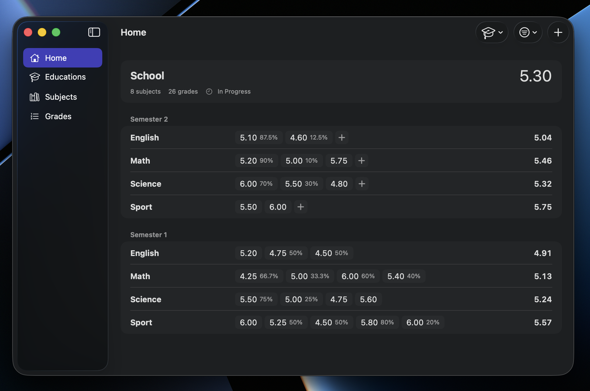

<div align="center">


</div>

<h1 align="center">Scade</h1>

<div align="center">


A weighted grade tracker for macOS, on the Swiss 1–6 scale.

</div>



Educations hold subjects, subjects hold grades, and every average is weighted
on the way up.

It is built to be used, not published: there is no release download and no
App Store listing. You build it once and keep it in `/Applications` like any
other app. See [docs/STATUS.md](docs/STATUS.md) for what that means and what
it leaves unfinished.

## Why this exists

Scade answers [GradeMaster](https://github.com/tgmaurer/GradeMaster), an
open-source grade manager for Windows: .NET MAUI and Blazor, drawing Bootstrap
inside a WebView2 control, storing SQLite through Entity Framework Core. It is
maintained and it still works. What changed is the machine it is used on every
day, which is now a Mac.

**A port was possible. I decided against it.** .NET MAUI targets Mac Catalyst,
so the existing codebase could have been taken to Apple platforms; this was a
choice rather than a constraint.

GradeMaster is also the older of the two, written earlier in my career, and it
carries what that implies: Entity Framework Core trusted further than it
earns, and early structural decisions that everything since has been built on.
None of it is a hard lock to Windows — a web view drawing Bootstrap where a
native toolkit exists, packaging shaped around one platform, an ORM that
decides for itself what to write — but all of it would have come along, and
all of it is cheaper to leave behind than to unpick. Running on macOS is not
the same as belonging there.

So I chose a fresh native app over a port: the same domain on a stack picked
for the platform it runs on. That also let me answer a question a port would
not have — how good an app an AI agent produces when the work is driven by a
written specification instead of a conversation, and when that specification
is itself derived from the codebase being replaced.
[How it was built](#how-it-was-built) is the rest of that answer.

| | GradeMaster | Scade |
|---|---|---|
| Platform | Windows 10 / 11 | macOS 26.5+ |
| UI | Blazor + Bootstrap in WebView2 | SwiftUI, native |
| Data | SQLite via Entity Framework Core | SQLite via GRDB, explicit queries |
| Install | Installer from Releases, ~1 GB | Build it yourself, 10 MB app |
| Licence | GPL-3.0 | GPL-3.0 |

What carried over is the domain — educations hold subjects, subjects hold
grades, weights all the way up — and the judgement about what a screen needs
to say. What did not carry over is the architecture, and in two places not
even the behaviour: [SPEC.md](docs/SPEC.md) §3.2 weights each subject's
contribution to its education where GradeMaster averages them evenly, and
§3.4 rejects out-of-range input with a visible field error where GradeMaster
silently clamped it. Both changes are recorded there with the reasoning.

## Requirements

- macOS 26.5 or later
- Xcode 26.5 or later, signed in with an Apple ID (a free account is enough —
  the app uses no capability that needs a paid membership)

## Install

Clone the repository and change into it:

```sh
git clone https://github.com/tgmaurer/Scade.git
cd Scade
```

Every command below is run from that directory — `xcodebuild` is pointed at
`Scade.xcodeproj` by relative path, so running it anywhere else finds
nothing.

Then build a Release copy and move it into `/Applications`:

```sh
xcodebuild -project Scade.xcodeproj -scheme Scade -configuration Release \
  -destination 'platform=macOS' -derivedDataPath build
cp -R build/Build/Products/Release/Scade.app /Applications/
rm -rf build
```

The last command deletes the build tree. `-derivedDataPath build` keeps it
inside the repository rather than in `~/Library/Developer/Xcode/DerivedData`,
which is what makes it easy to find — and easy to forget. It holds a few
hundred megabytes of intermediates around a 10 MB app, it is already in
`.gitignore`, and the copy in `/Applications` does not depend on it.

Then open it from `/Applications` and keep it in the Dock. Gatekeeper is
satisfied because the app is signed with your own development certificate on
the machine that built it; it is not notarised, so it will not run on anyone
else's Mac without them building it too.

To update it: `git pull` in the same directory, run those three commands
again, and replace the copy in `/Applications`. Your data is not inside the
app and is not touched by this.

## Where your data lives

One SQLite file, inside the app's sandbox container:

```
~/Library/Containers/com.tgmaurer.Scade/Data/Library/Application Support/Scade/scade.sqlite
```

That path is not a detail you normally need — it matters when you restore a
backup, below. Nothing else in the app writes outside its container except
the backups you ask for.

## Backing up

**Settings → Backup** (`⌘,`). Choose a folder once, then press **Back Up
Now** whenever you want a copy.

Choose a folder in **iCloud Drive** — say `iCloud Drive/Scade`. The point of
a backup is to survive this Mac, and one written to this Mac's disk does not.
The panel opens in iCloud Drive for that reason. Anywhere else works the same
way if you would rather your grades not sync.

Scade cannot pick the folder for you: it is sandboxed, so it can only write
where you have pointed it, and it remembers your choice as a security-scoped
bookmark rather than a path.

Each backup is a dated folder — `Scade Backup 2026-08-27` — holding five
files:

| File | What it is |
|---|---|
| `scade.sqlite` | The whole database. **This is the file that restores the app.** |
| `overview.csv` | Everything on one sheet. **Open this one.** |
| `educations.csv` | One row per education |
| `subjects.csv` | One row per subject, `educationId` pointing at its education |
| `grades.csv` | One row per grade, `subjectId` pointing at its subject |

**`overview.csv` is the one to open in a spreadsheet.** One row per grade,
with the subject and education that place it spelled out on the same row, so
there is nothing to join. The three tables under it keep the ids instead, and
those are what a script or a re-import wants — but reading them means joining
on `educationId` and `subjectId`, which Excel will do through Power Query and
Numbers will not do at all.

Nothing is missing from the flat sheet: an education with no subjects and a
subject with no grades each still get a row, with the columns below them
empty.

Backing up twice in one day refreshes that day's folder rather than making a
second one. Earlier days are never touched.

The CSVs are for reading — a spreadsheet, a script, anything that outlives
this app. They carry stored values rather than displayed ones, so `weight` is
the multiplier the app calculates with: `1.0` is the `100%` you see on
screen, `0.25` is `25%`. The two exceptions are `overview.csv`'s
`subjectAverage` and `educationAverage`, the only computed columns in any of
these files: they are rounded to two decimals, exactly as the app shows them,
and an empty cell there means the same as `N/A` on screen. They are UTF-8 with a byte order mark and CRLF line
endings, which is what Excel needs to read umlauts correctly on a
double-click.

## Restoring

There is no Import button. Restoring is a file copy, and it has one rule:

1. **Quit Scade.** The app holds the database open, and will overwrite
   whatever you put there if it is still running.
2. Replace the live database with the one from your backup:

   ```sh
   cp "/path/to/Scade Backup 2026-08-27/scade.sqlite" \
     ~/Library/Containers/com.tgmaurer.Scade/Data/Library/Application\ Support/Scade/scade.sqlite
   ```

3. Open Scade. Everything from that backup is there.

If you would rather not overwrite, move the current file aside first instead
of deleting it — it is the only copy of anything you have not backed up.

## Repository layout

| Path | What's in it |
|---|---|
| `App/` | The `App` target: opens the database and hands it over |
| `ScadeKit/Sources/ScadeKit/` | Models, business logic, GRDB persistence |
| `ScadeKit/Sources/ScadeUI/` | Every screen |
| `ScadeKit/Tests/` | Unit tests for the logic and persistence |
| `UITests/` | End-to-end tests |
| `docs/` | The specs — start with `SPEC.md`, then `STATUS.md` |

## Built with

**Swift 6 and SwiftUI**, native the whole way down. No cross-platform
runtime, no web view, no UI framework standing between the app and the
system. Swift 6 language mode throughout, so data-race safety is checked by
the compiler rather than left to convention — the view layer is main-actor
by default and the domain layer is `Sendable` and isolated to nothing.

SwiftUI draws every screen, and the menu bar, the toolbars and the Settings
window are its own `Commands` and `Settings` scenes rather than hand-built
imitations — so the app inherits macOS's behaviour instead of approximating
it. The same code renders the iOS screens; see
[docs/STATUS.md](docs/STATUS.md) for how far that got.

AppKit appears in four files, each of them somewhere SwiftUI has no
equivalent: the backup folder panel (`NSOpenPanel`), Show in Finder
(`NSWorkspace`), Toggle Sidebar, and window tabbing. UIKit appears nowhere
at all.

Models, business logic and persistence sit in a Swift package target that
imports no UI framework — 31 files, none of them touching SwiftUI — so every
average and every validation rule is testable without a screen. Those tests
use **Swift Testing**; the end-to-end tests drive the real app through
**XCUITest**.

[GRDB.swift](https://github.com/groue/GRDB.swift) by Gwendal Roué — the SQLite
toolkit the whole persistence layer sits on. MIT licensed. It is Scade's only
dependency, and it is credited in the app as well, under **Settings → About**.

## How it was built

Most of this code was written by an AI agent — Claude Code — working against
a written contract rather than a conversation. That is worth describing only
because the method is visible in the repository and can be checked against it.

**The specification came first, and it was derived from the old app.** The
agent read GradeMaster's source and wrote [SPEC.md](docs/SPEC.md) from it —
"merging architectural decisions with the functional/logic audit of the old
app", as the document says at the top. That audit is what lets it separate
GradeMaster's intentional rules from its accidents: §3.4 records that the old
minimum of `0` on a grade value was unreachable code rather than a design
decision, and drops it, while §3.1's weighting is kept because it was meant.

The result is 399 lines of what the app does — the schema, the two averaging
formulas, validation rules field by field, screen by screen. It was committed
with `CLAUDE.md` on 28 July 2026; the first feature pull request merged on 29
July. Everything after that is argued against the document rather than against
the last message in a chat. Three more joined it:
[SPEC-POLISH.md](docs/SPEC-POLISH.md) for look and feel,
[SPEC-BACKLOG.md](docs/SPEC-BACKLOG.md) for what is deliberately *not* built,
and [STATUS.md](docs/STATUS.md) for where development stopped and why.

**The constraints are standing, not per-prompt.** `CLAUDE.md` holds the rules
the agent is held to on every task, and they are architectural rather than
stylistic. No ORM change-tracking — a direct reaction to Entity Framework in
GradeMaster: GRDB only, explicit queries, no ambient state. Business logic in
one place, unit-tested, never duplicated across call sites. GradeMaster is a
reference for *what* a screen must say and never for *how* it was built.

**Nothing is trusted because the model said it.** The package runs 297 tests.
The averaging tests were themselves checked, by breaking the calculator four
ways on purpose — dividing by count instead of total weight, rolling up raw
grades instead of subject averages, applying a weight twice, counting an
ungraded subject as zero — and confirming the suite caught each one. The
migration suite starts from a literal copy of the schema that shipped, so
editing the original migration in place cannot quietly keep it green.

**Claims are measured in the running app.** Help tags were verified by reading
`AXHelp` back through the accessibility API rather than by watching for a
tooltip; the schema migration was timed against a real database; the install
instructions above were run end to end from a fresh clone.

That last habit exists for a reason. The agent once concluded, from a tooltip
that failed to appear, that one SwiftUI modifier had to be applied above
another — and wrote it into both a code comment and the polish spec. It was
wrong; a twenty-line probe app disproved it, and the correction is in the
history. **An agent being confidently wrong is the normal case, not the
exception, and a process that can't catch it is not a process.**

The division of labour, then: the agent wrote the specification and the code.
The direction, the product decisions and the review that accepted or rejected
each change were mine — and a specification is only a contract if somebody
else is holding the other end of it.

## Licence

GPL-3.0. See [LICENSE](LICENSE).
