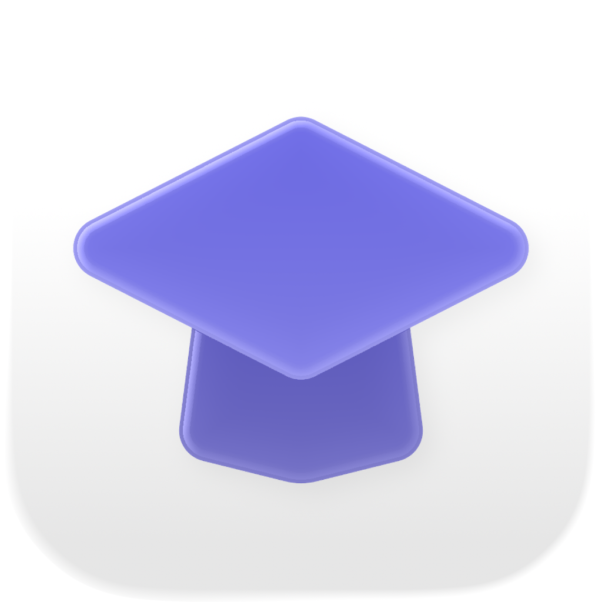
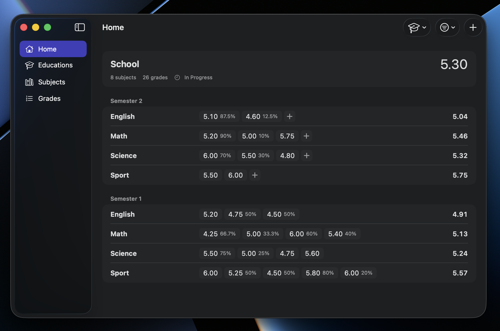

<div align="center">



</div>

<h1 align="center">Scade</h1>

<div align="center">


A weighted grade tracker for macOS, on the Swiss 1–6 scale.

</div>



An education holds subjects, a subject holds grades, and every average is
weighted: grades within a subject, and subjects within an education.

Scade isn't on the App Store. Download it from
[Releases](https://github.com/tgmaurer/Scade/releases/latest) or build it
yourself, and keep it in `/Applications` like any other app. See
[docs/STATUS.md](docs/STATUS.md) for what is left unfinished.

**Maintenance.** Scade is finished enough for me to use every day, and I don't
plan to develop it further. It isn't abandoned: I fix what breaks and keep it
building and working, as needed, and nothing beyond that. The iOS app is
unfinished and stays that way for now. Issues are welcome, but I can't promise
a response time or that a feature request will be taken up.

## Why this exists

I wanted a grade tracker that works the way I do: weights that match how a
course is actually graded, and data kept in a file on my own machine instead
of in someone else's account.

[GradeMaster](https://github.com/tgmaurer/GradeMaster) was my first attempt
at that. It is an open-source grade manager for Windows, built with .NET MAUI
and Blazor. It renders a Bootstrap UI inside a WebView2 control and stores its
data in SQLite through Entity Framework Core. It is still maintained and it
still works. What changed is that I now use a Mac every day.

**A port was possible, and I decided against it.** .NET MAUI targets Mac
Catalyst, so the existing codebase could have been brought to Apple
platforms. Nothing forced a rewrite.

I wrote GradeMaster earlier in my career, and it shows. It relies on Entity
Framework Core more than it should, and everything since has been built on a
few early structural decisions. None of that ties it to Windows, but a port
would have brought all of it along: a web view rendering Bootstrap where a
native toolkit exists, packaging shaped around one platform, and an ORM that
decides for itself what to write. Leaving those behind is cheaper than
untangling them, and an app that merely runs on macOS doesn't feel like it
belongs there.

So I wrote a new native app: the same domain, on a stack chosen for the
platform it runs on. A rewrite also let me test something a port could not:
how good an app an AI agent produces when it works from a written
specification instead of a conversation, and when that specification is
derived from the codebase being replaced.
[How it was built](#how-it-was-built) describes how that went.

| | GradeMaster | Scade |
|---|---|---|
| Platform | Windows 10 / 11 | macOS 26+ |
| UI | Blazor + Bootstrap in WebView2 | SwiftUI, native |
| Data | SQLite via Entity Framework Core | SQLite via GRDB, explicit queries |
| Install | Installer from Releases, ~1 GB | Zip from Releases or build it yourself, 4 MB |
| Licence | GPL-3.0 | GPL-3.0 |

The domain carried over: educations hold subjects, subjects hold grades, and
weights apply at both levels. So did the judgement about what each screen
needs to show. The architecture did not, and in two places the behaviour
changed as well. [SPEC.md](docs/SPEC.md) §3.2 weights each subject's
contribution to its education, where GradeMaster averages subjects evenly.
§3.4 rejects out-of-range input with a visible field error, where GradeMaster
silently clamped it. The spec records the reasoning for both.

## Requirements

- macOS 26.0 or later
- An Apple Silicon Mac. There is a separate build for Intel Macs, but macOS
  26 is the last release Apple ships for Intel, so that build is kept working
  and gets no further attention.
- To build from source: Xcode 26 or later. You need the full Xcode app,
  because the Command Line Tools alone aren't enough. You don't need an Apple
  ID or a developer account, because the app is signed to run locally.

## Install

If you have Xcode, [building from source](#build-from-source) is simpler:
one command picks the right build for your Mac, and there is no quarantine
flag to clear.

Each [release](https://github.com/tgmaurer/Scade/releases/latest) has two
zips, one for each kind of Mac. To see which kind you have, open the Apple
menu and choose **About This Mac**. It lists either an Apple M-series chip or
an Intel processor.

| Mac | Download |
|---|---|
| Apple Silicon (M1 and later) | `Scade-<version>-macOS-arm64.zip` |
| Intel | `Scade-<version>-macOS-x86_64.zip` |

`Scade.app` is a folder that macOS displays as a single app, so it ships
inside a zip. Unzip it, move the app into `/Applications`, and clear the
quarantine flag. With the zip in `~/Downloads`, run this in Terminal. On an
Intel Mac, change `arm64` to `x86_64`.

```sh
cd ~/Downloads &&
unzip Scade-*-macOS-arm64.zip &&
rm -rf /Applications/Scade.app &&
mv Scade.app /Applications/ &&
sudo xattr -cr /Applications/Scade.app
```

The `rm -rf` line removes any earlier version, because `mv` won't replace an
app that is already there. On a first install it does nothing. The `&&`
between the lines means each step runs only if the one before it worked, so
if the unzip fails, your installed copy is left alone instead of being
deleted with nothing to replace it.

Safari unzips downloads on its own by default. If `Scade.app` is already in
`~/Downloads`, leave out the `unzip Scade-*-macOS-arm64.zip &&` line.
Otherwise `unzip` finds no zip, and the commands stop there.

**The `xattr` line is required.** The download is not signed with a
Developer ID or notarised by Apple, because both need a paid membership and
this app isn't being sold. Your browser marks every download with a
quarantine flag, and Gatekeeper refuses to open an unnotarised app that has
one. The message is usually *"Scade" is damaged and can't be opened*, which
is misleading, because the app isn't damaged. `xattr -cr` clears the flag,
and after that Scade opens like any other app. Run it only on a copy you
downloaded from this repository's Releases page.

To update, quit Scade and run the same commands on the new zip. Your data
is not inside the app, so replacing the app doesn't touch it.

## Build from source

This is the simpler install if you already have Xcode. It needs no download
and no `xattr` step, and it builds for your Mac automatically. It does need
the full Xcode app: the Command Line Tools on their own don't include what
`xcodebuild` needs to build an app.

Clone the repository and change into it:

```sh
git clone https://github.com/tgmaurer/Scade.git
cd Scade
```

Run every command below from that directory. `xcodebuild` finds
`Scade.xcodeproj` by relative path, so from anywhere else it finds nothing.

Then build a Release copy and move it into `/Applications`:

```sh
xcodebuild -project Scade.xcodeproj -scheme Scade -configuration Release \
  -destination 'platform=macOS' -derivedDataPath build &&
rm -rf /Applications/Scade.app &&
cp -R build/Build/Products/Release/Scade.app /Applications/ &&
rm -rf build
```

`-destination 'platform=macOS'` means this Mac, so the app is built for its
architecture only: Apple Silicon on an M-series Mac, Intel on an Intel one.

The first `rm -rf` removes any earlier version, so `cp -R` makes a clean
copy instead of merging into the old one. It does nothing on a first
install. The `&&` chain means it only runs once the build has succeeded: a
failed build leaves your installed copy where it is.

The last command deletes the build tree. `-derivedDataPath build` keeps that
tree inside the repository rather than in `~/Library/Developer/Xcode/DerivedData`,
which makes it easy to find and also easy to forget. The tree holds a few
hundred megabytes of intermediates around a 10 MB app. It is already in
`.gitignore`, and the copy in `/Applications` does not depend on it.

Then open Scade from `/Applications` and keep it in the Dock. You don't need
the `xattr` step here. The app was built on the Mac it runs on and never
downloaded, so it has no quarantine flag.

To update, quit Scade, run `git pull` in the same directory, and run the
same commands again.

### Building for a specific architecture

You only need this to build for a Mac other than the one you're on, which is
how both release zips are made on one machine. Swap the destination for
`'generic/platform=macOS'` and name the architecture:

```sh
# Apple Silicon
xcodebuild -project Scade.xcodeproj -scheme Scade -configuration Release \
  -destination 'generic/platform=macOS' -derivedDataPath build ARCHS=arm64

# Intel
xcodebuild -project Scade.xcodeproj -scheme Scade -configuration Release \
  -destination 'generic/platform=macOS' -derivedDataPath build ARCHS=x86_64
```

`generic/platform=macOS` means any Mac rather than this one, so Xcode builds
every architecture the project lists. Without `ARCHS`, that is a universal
app of about 18 MB that runs on both kinds of Mac.

## Where your data lives

One SQLite file, inside the app's sandbox container:

```
~/Library/Containers/com.tgmaurer.Scade/Data/Library/Application Support/Scade/scade.sqlite
```

You don't normally need this path. It matters when you
[restore a backup](#restoring). The only other place Scade writes to is the
backup folder you choose.

## Backing up

Open **Settings → Backup** (`⌘,`). Choose a folder once, then press **Back Up
Now** whenever you want a copy.

A folder in **iCloud Drive** is the best choice, for example
`iCloud Drive/Scade`. A backup should survive the loss of this Mac, and one
that exists only on this Mac's disk won't. That is why the folder panel opens
in iCloud Drive. Any other folder works the same way if you would rather not
sync your grades.

Scade can't pick the folder for you. It is sandboxed, so it can only write to
a folder you have chosen, and it remembers that choice as a security-scoped
bookmark instead of a path.

Each backup is a dated folder, such as `Scade Backup 2026-08-27`, holding
five files:

| File | What it is |
|---|---|
| `scade.sqlite` | The whole database. **This is the file that restores the app.** |
| `overview.csv` | Everything on one sheet. **Open this one.** |
| `educations.csv` | One row per education |
| `subjects.csv` | One row per subject, `educationId` pointing at its education |
| `grades.csv` | One row per grade, `subjectId` pointing at its subject |

**`overview.csv` is the one to open in a spreadsheet.** It has one row per
grade, with that grade's subject and education written out on the same row,
so there is nothing to join. The other three CSVs keep ids instead, which is
what a script or a re-import needs. Reading those by hand means joining on
`educationId` and `subjectId`, which Excel does through Power Query and
Numbers can't do at all.

The overview leaves nothing out. An education with no subjects, or a subject
with no grades, still gets a row, with the subject or grade columns left
empty.

Backing up twice in one day updates that day's folder instead of creating a
second one. Folders from earlier days are never touched.

The CSVs are for reading, whether in a spreadsheet, in a script, or in
anything else that outlives this app. They hold values as the database stores
them, so `weight` is the multiplier the app calculates with: `1.0` is the
`100%` you see on screen, and `0.25` is `25%`. The two exceptions are
`subjectAverage` and `educationAverage` in `overview.csv`, the only computed
columns in any of these files. They are rounded to two decimals, exactly as
the app shows them, and an empty cell there means the same as `N/A` on
screen.

All four CSVs are UTF-8 with a byte order mark and CRLF line endings, which
is what Excel needs to read umlauts correctly when you double-click a file.

## Restoring

There is no Import button. Restoring means copying one file while Scade is
not running:

1. **Quit Scade.** The app keeps the database open, and if it is still
   running it will overwrite whatever you put there.
2. Replace the live database with the one from your backup:

   ```sh
   cp "/path/to/Scade Backup 2026-08-27/scade.sqlite" \
     ~/Library/Containers/com.tgmaurer.Scade/Data/Library/Application\ Support/Scade/scade.sqlite
   ```

3. Open Scade. Everything from that backup is there.

The current file is the only copy of anything you haven't backed up. If you
might want it back, move it aside before step 2 instead of overwriting it.

## Repository layout

| Path | What's in it |
|---|---|
| `App/` | The `App` target: opens the database and hands it to the view layer |
| `ScadeKit/Sources/ScadeKit/` | Models, business logic, GRDB persistence |
| `ScadeKit/Sources/ScadeUI/` | Every screen |
| `ScadeKit/Tests/` | Unit tests for the logic and persistence |
| `UITests/` | End-to-end tests |
| `docs/` | The specs. Start with `SPEC.md`, then `STATUS.md` |

## Built with

Scade is written in **Swift 6 and SwiftUI** and is native throughout. It has
no cross-platform runtime, no web view, and no third-party UI framework
between the app and the system. The Swift 6 language mode is on everywhere,
so the compiler checks data-race safety instead of leaving it to convention.
The view layer is main-actor isolated by default, and the domain layer is
`Sendable` with no actor isolation.

SwiftUI draws every screen. The menu bar, the toolbars and the Settings
window are built with SwiftUI's own `Commands` and `Settings` scenes, so the
app gets standard macOS behaviour instead of a hand-built imitation of it.
The same code renders the iOS screens; see [docs/STATUS.md](docs/STATUS.md)
for how far that got.

AppKit appears in five files, each for something SwiftUI has no equivalent
for: the backup folder panel (`NSOpenPanel`), Show in Finder (`NSWorkspace`),
Toggle Sidebar, window tabbing, and quitting when the last window closes.
UIKit isn't used at all.

Models, business logic and persistence live in a Swift package target of 31
files that imports no UI framework, so every average and every validation
rule can be tested without a screen. Those tests use **Swift Testing**. The
end-to-end tests drive the real app through **XCUITest**.

The persistence layer is built on
[GRDB.swift](https://github.com/groue/GRDB.swift) by Gwendal Roué, an
MIT-licensed SQLite toolkit. It is Scade's only dependency, and it is also
credited in the app under **Settings → About**.

## How it was built

Most of this code was written by an AI agent, Claude Code, working from a
written specification instead of a conversation. I describe the method here
because it is visible in the repository, so each claim below can be checked
against it.

**The specification came first, and it was derived from the old app.** The
agent read GradeMaster's source and wrote [SPEC.md](docs/SPEC.md) from it,
"merging architectural decisions with the functional/logic audit of the old
app", as the document says at the top. That audit let the spec separate
GradeMaster's intentional rules from its accidents. §3.4 records that the old
minimum of `0` on a grade value was unreachable code, not a design decision,
and drops it. §3.1 keeps the weighting, because that was intended.

The result is 399 lines describing what the app does: the schema, the two
averaging formulas, the validation rules for every field, and every screen.
It was committed together with `CLAUDE.md` on 28 July 2026, and the first
feature pull request merged on 29 July. Every change since then has been
judged against that document, not against the last message in a chat. Three
more documents joined it later: [SPEC-POLISH.md](docs/SPEC-POLISH.md) for
look and feel, [SPEC-BACKLOG.md](docs/SPEC-BACKLOG.md) for what is
deliberately *not* built, and [STATUS.md](docs/STATUS.md) for where
development stopped and why.

**The constraints apply to every task.** `CLAUDE.md` holds the rules the
agent must follow whatever the prompt says, and they are about architecture
more than style:

- No ORM change-tracking. This is a direct reaction to Entity Framework in
  GradeMaster: GRDB only, explicit queries, no ambient state.
- Business logic lives in one place, is unit-tested, and is never duplicated
  across call sites.
- GradeMaster is a reference for *what* a screen must say, never for *how* it
  was built.

**Nothing is trusted just because the model said it.** The package runs 297
tests. The averaging tests were themselves tested by breaking the calculator
on purpose in four ways and confirming that the suite caught each one:
dividing by count instead of total weight, rolling up raw grades instead of
subject averages, applying a weight twice, and counting an ungraded subject
as zero. The migration suite starts from a literal copy of the schema that
shipped, so editing the original migration in place can't quietly keep the
suite green.

**Claims are checked in the running app.** Help tags were verified by reading
`AXHelp` back through the accessibility API instead of watching for a
tooltip. The schema migration was timed against a real database. The
build-from-source instructions above were run end to end from a fresh clone.

That habit exists for a reason. The agent once concluded, from a tooltip that
failed to appear, that one SwiftUI modifier had to be applied above another,
and wrote that into both a code comment and the polish spec. It was wrong. A
twenty-line probe app disproved it, and the correction is in the history.
**An agent being confidently wrong is the normal case, so the process has to
be built to catch it.**

So the division of labour was this: the agent wrote the specification and the
code. The direction, the product decisions and the review that accepted or
rejected each change were mine. A specification only works as a contract when
someone other than its author enforces it.

## Licence

GPL-3.0. See [LICENSE](LICENSE).
